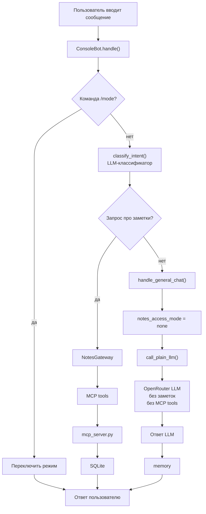
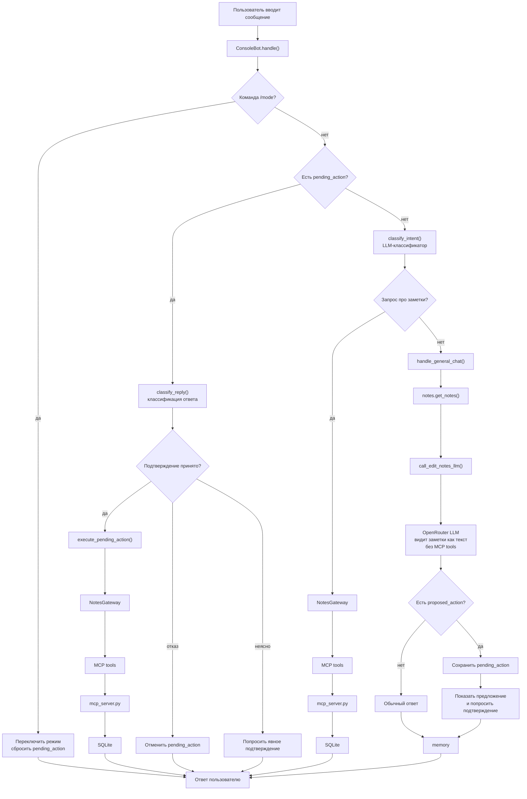

# Note Agent

Консольный чат-бот на Python + LangChain + MCP.

У бота есть две разделённые ветки:

- ветка заметок: вызывает MCP-инструменты из `mcp_server.py`;
- обычная ветка: отправляет запрос напрямую в LLM через агрегатора провайдеров OpenRouter, без MCP-инструментов.

Маршрутизация интента выполняется небольшим LLM-классификатором. По умолчанию используется:

```env
OPENROUTER_CLASSIFIER_MODEL=google/gemma-4-31b-it
```

MCP-инструменты для заметок:

- `add_note(text)`
- `list_notes()`
- `delete_note(id)`
- `update_note(id, text)`

Обычная LLM-ветка хранит короткую историю диалога в `bot.memory`.

Все аутентифицированные пользователи считаются `writer`. Пользователь может создавать, смотреть, изменять и удалять только свои заметки.

Режимы доступа обычной LLM-ветки к заметкам:

- `none`: LLM не видит заметки;
- `read`: LLM видит заметки как контекст, но не может их менять;
- `edit`: LLM видит заметки и может предложить добавить, изменить или удалить заметку. Бот выполняет действие только после подтверждения пользователя.

Ответы на подтверждение в режиме `edit` обрабатываются гибридно:

- очевидные ответы вроде `да`, `нет`, `отмена`, `подтверждаю` обрабатываются построчными правилами;
- неоднозначные ответы (`конечно`, `да нет`, `можно, но не сейчас`, `ага`) отправляются в LLM-классификатор;
- удаление заметки требует более уверенного подтверждения, чем обычное изменение.

В консольном режиме можно переключать режим доступа к заметкам:

```text
/mode none
/mode read
/mode edit
```

## Разделение режимов LLM

Режим `none` соответствует ТЗ. В этом режиме обычная ветка бота делает прямой вызов LLM через OpenRouter: LLM не получает MCP-инструменты и не видит заметки пользователя. Если запрос относится к заметкам, бот явно уходит в ветку MCP и вызывает нужный инструмент.

Режим `edit` не является базовым режимом из ТЗ. Это расширение проекта: обычная LLM-ветка получает заметки пользователя как текстовый контекст и может предложить действие с заметкой. Даже в этом режиме LLM не получает MCP-инструменты напрямую. Реальное изменение заметок выполняет бот через MCP только после отдельного подтверждения пользователя.

Работа бота в обоих режимах представлена в `notebooks/demo.ipynb`

### Диаграмма режима `none`



### Диаграмма режима `edit`



## Установка

```powershell
python -m venv note-agent-venv
.\note-agent-venv\Scripts\Activate.ps1
pip install -r requirements.txt
```

## Настройка OpenRouter

Необходимо создать локальный `.env` из примера:

```powershell
Copy-Item .env.example .env
```

Затем укажите рабочий api ключ OpenRouter в `.env`):

```env
OPENROUTER_API_KEY=your_real_key_here
OPENROUTER_MODEL=qwen/qwen3.7-plus
OPENROUTER_CLASSIFIER_MODEL=google/gemma-4-31b-it
OPENROUTER_BASE_URL=https://openrouter.ai/api/v1
```

По умолчанию используются модели от платных провайдеров, необходимо чтобы на OpenRouter был достаточный баланс.

## Запуск консольного бота

Для входа используется переменная `BOT_USERS_JSON`. Боту нужен id пользователя и SHA-256-хеш токена.

Пример:

```powershell
$tokenHash = python -c "import hashlib; print(hashlib.sha256('demo-token'.encode()).hexdigest())"
$env:BOT_USERS_JSON = "{`"user1`": {`"token_sha256`": `"$tokenHash`"}}"
```

Запуск:

```powershell
python bot.py
```

## Запуск notebook demo

```powershell
jupyter notebook notebooks/demo.ipynb
```

Notebook импортирует проект напрямую, создаёт demo-пользователей без интерактивного входа и показывает:

- переключение между разными пользователями;
- выбор режима доступа к заметкам;
- что память нового объекта агента начинается пустой;
- добавление, просмотр, изменение и удаление заметок через MCP;
- обычный вопрос через OpenRouter;
- пример, где LLM сравнивает заметку со списком покупок с рецептом бостонского пирога и предлагает обновить заметку.

Обычная LLM-ветка требует рабочий `OPENROUTER_API_KEY` в `.env`.

## Запуск тестов

```powershell
pytest
```
